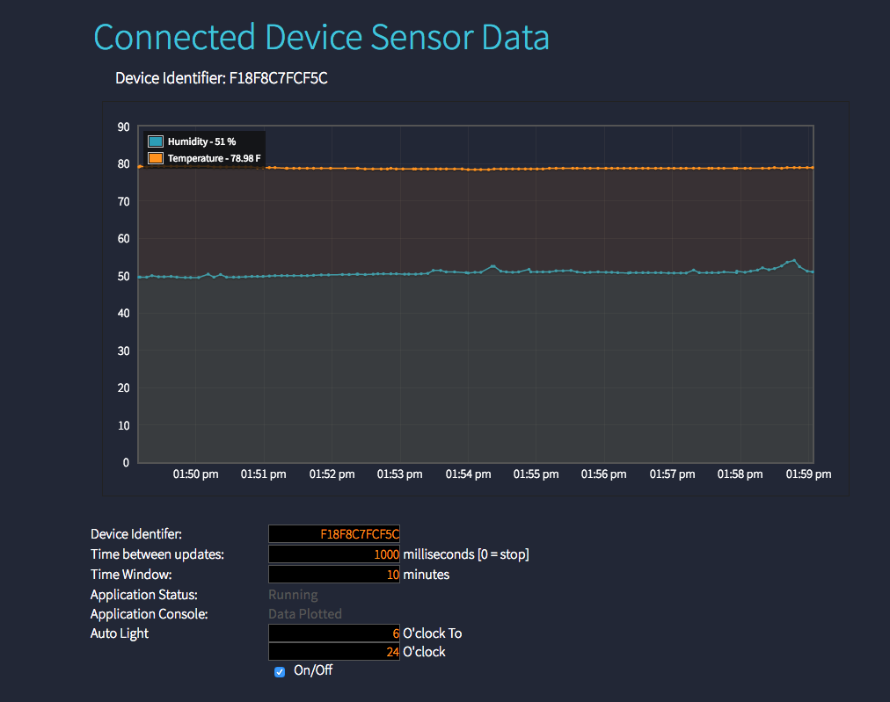

# Summary
This example shows how to create a basic Murano Solution Application that consists of a single web page that graphs sensor data for a specific device.

### Shows:
* Interacting with Solution API Routes from Web Page (HTML/Javascript)
* Deploying a simple (HTML,CSS,Javascript) single page web app
* Murano Service Routing
 * Time Series data - Routing product data into time series database and querying out for the graph
 * Key Value data - Routing product data into key/value storage

### Does Not Include
* Users / Auth - this is a simple public web page for development and education purposes only
* Device / Product code - Assumes data is being generated by a device in a Murano Product instance.  

### Assumptions
A device is sending data with resources `temperature` and `humidity` to your Product instance.

### To use:
1. Create a Solution - using this template 'https://github.com/exosite/murano-getting-started-solution-1/blob/master/Solutionfile.json' to populate the solution API Routes, Assets, and Service Set-up.

#### Notes:
1. WARNING: This is reference code, there are no guarantees.  It's easy to change the code and have it break.  Tip: Use source control when editing!
2. WARNING: Using code that refreshes often in browser windows carefully.  You can easily kill your browser.


### Start to create your Solution:
Remember to `exosite --init` when you begin, and `exosite --deploy` after you insert new code.

#### api_routes.lua
Insert the following code at the final line, and don't remove the comments.
```lua

--#ENDPOINT POST /development/lightbulb/{identifier}/{fromhour}/{tohour}/{isauto}
-- Description: POST lightbulb automatically turned on form fromhour to tohour
function getHour(utc)
  return tonumber(os.date("%H", os.time() + utc * 60 * 60))
end

local identifier = tostring(request.parameters.identifier)
local fromhour = tonumber(request.parameters.fromhour)
local tohour = tonumber(request.parameters.tohour)
local isauto = tostring(request.parameters.isauto)

local nowtime = getHour(8)
local ret
if fromhour <= nowtime and nowtime <= tohour then
  ret = write(identifier, "state", isauto)
else
  isauto = "0"
  ret = write(identifier, "state", isauto)
end

ret.lightbulb = isauto
return ret

--#ENDPOINT POST /timertrigger
-- Description: create a weekly trigger to send SMS to user (timerid = sms_trigger)
local alert = {
  message = "trigger",
  timer = 3 * 60,
  timerid = "sms_trigger",
  timer_running = true
}

Timer.sendInterval({
    message = alert.message,
    duration = alert.timer * 1000,
    timer_id = alert.timerid
})

--#ENDPOINT POST /canceltrigger
-- Description: cancel sms_trigger trigger
local parameters = {
 ["timer_id"] = "sms_trigger"
}

return Timer.cancel(parameters)

--#ENDPOINT POST /sms
-- Description: sms test
return Twilio.postMessage({
  From = "+16122551754",
  To = "+886935658234",
  Body = "Exosite Swimming Pool Notification\n"
})
```

#### assets/index.html
Insert the following code at the line 68 (between the tag `</tr>` and `</table>`)
```html
<tr>
    <td>
        <p>Auto Light</p>
    </td>
    <td>
        <p>
            <input id="fromhour" type="text" value="6" style="text-align: right; width:10em"></input> O'clock To
        </p>
        <p>
            <input id="tohour" type="text" value="24" style="text-align: right; width:10em"></input> O'clock
        </p>
        <label class="switch">
            <input id="mylight" type="checkbox" name="mylight" value="light" checked>
            <div class="slider round"></div>
        </label>
    </td>
</tr>
```

### assets/script.js
Insert the following codes at the line 186 (above `});` )
```Javascript
function autoLightbulb() {
    const identifier = myDevice;
    const fromhour = parseInt($('#fromhour').val());
    const tohour = parseInt($('#tohour').val());
    const isauto = $("#mylight").is(':checked') ? "1" : "0";

    $.ajax({
        url: app_domain + "development/lightbulb/" + identifier + "/" + fromhour + "/" + tohour + "/" + isauto,
        type: "POST",
        contentType: "application/json",
        dataType: "json",
        success: function(data) {
            console.log(data);
            setTimeout(autoLightbulb, 1000);
        },
        crossDomain: true,
        error: function() {
            setTimeout(autoLightbulb, 1000);
        },
        statusCode: {
            504: null
        },
        timeout: 10000
    });
}
autoLightbulb();
```

### Timer Service API Code:
Insert the following code in Murano Service Timer page

```lua
local identifier = "YOUR_IDENTIFIER"
local read = kv_read_opt(identifier, true)
local temperature = tonumber(read.temperature)

local title = "Exosite Swimming Pool Notification"
local message = "Wellcome Exosite Swimming Pool :D"

if temperature >= 80 then
  message = "Today's temperature is " .. temperature .. "F" .. ".\nIs really hot right?\nWhy don't you come Exosite to swim with us :D"
elseif 70 <= temperature and temperature < 80 then
  message = "Today's temperature is " .. temperature .. "F" .. ".\nIt's a good time to practice swimming~"
elseif temperature < 70 then
  message = "Today's temperature is " .. temperature .. "F" .. ".\nToday is cold so we have spa for you!"
end

Twilio.postMessage({
    From = "+16122551754",
    To = "+886xxxxxxxxx",
    Body = title .. "\n" .. message
})

Email.send({
  to = "yyyyyyyyy@exosite.com",
  subject = title,
  text = message
})

```

### Examples of what it looks like


